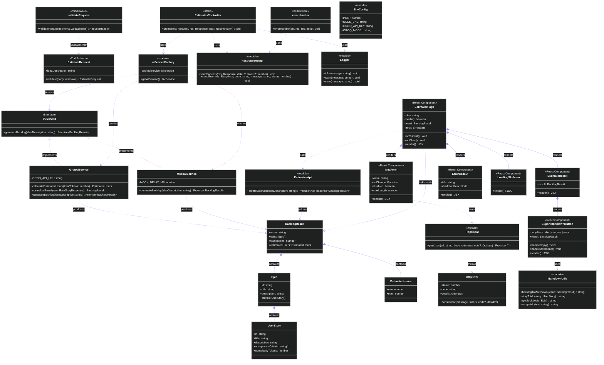

# Diagrama de Classes — MVP Estimator

> Representa a estrutura estática do sistema: classes, interfaces, atributos, métodos e relacionamentos. Baseado 1:1 no código em `src/` e `frontend/src/`.

---

## Diagrama

---

## Legenda de Relacionamentos

| Notação | Significado |
|---|---|
| `<\|..` | Implementação de interface |
| `*--` | Composição (parte pertence ao todo) |
| `..>` | Dependência (usa, chama, cria) |

## Padrões de Design Identificados

- **Strategy** — `IAIService` com `GroqAIService` e `MockAIService` como estratégias intercambiáveis
- **Factory** — `aiServiceFactory` seleciona a implementação por ambiente
- **Middleware Chain** — `validateRequest` → `EstimatesController` → `errorHandler`
- **Module Pattern** — `ResponseHelper`, `Logger`, `EnvConfig`, `MarkdownUtils` como módulos utilitários sem estado

---

*Versão: 1.1.0*
*Baseado no código real em `src/` e `frontend/src/`*
