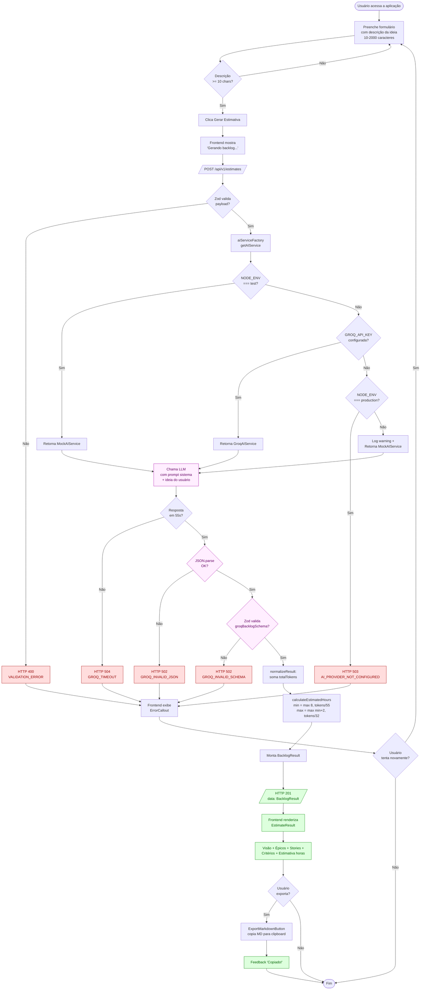

# Fluxograma de Funcionamento — MVP Estimator

> Fluxograma do funcionamento do produto, em notação Mermaid (renderizável diretamente no GitHub).

---

## Fluxo Principal — Geração de Estimativa

---

## Legenda

| Cor | Significado |
|---|---|
| 🟥 Vermelho | Caminho de erro tratado (HTTP 4xx/5xx com código próprio) |
| 🟩 Verde | Caminho feliz (resposta 201) |
| 🟪 Roxo | Interação com o LLM (chamada, parsing, validação) |

## Pontos-chave

1. **Validação em duas camadas:** Zod valida o request (entrada do usuário) e a resposta do LLM. Nenhum dado entra ou sai sem passar por schema.
2. **Determinismo no cálculo:** A IA gera o conteúdo (épicos, stories, complexityTokens). O cálculo final de horas é puramente aritmético — fácil de auditar, fácil de testar.
3. **Failover para Mock:** Em dev sem key e em testes, o `MockAIService` mantém o mesmo contrato. Nenhuma parte do código upstream (controller, frontend) sabe qual implementação está rodando.
4. **Timeout dura 55s:** Cabe dentro do limite de 60s do PRD, deixando margem para serialização da resposta.

---
*Versão: 1.0.0*
