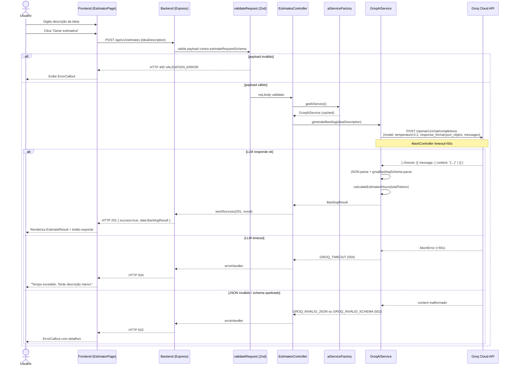
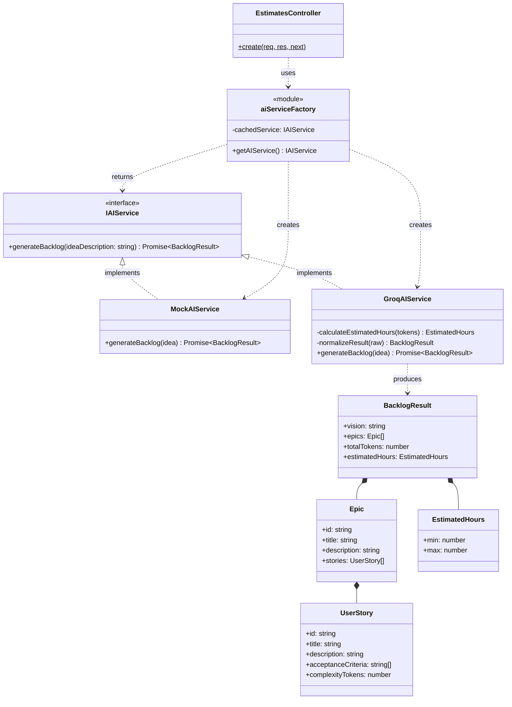
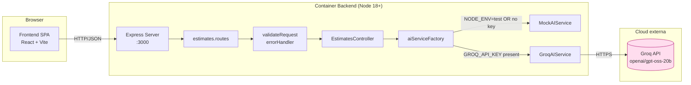

# Diagramas UML — MVP Estimator

> Diagramas gerados com auxílio de IA (Claude) a partir do código real em `src/` e `frontend/src/`. Notação Mermaid (renderizável diretamente no GitHub).

---

## 1. Diagrama de Sequência — Fluxo de geração de estimativa

Mostra o caminho completo de uma requisição: do formulário no frontend até a resposta do LLM e o retorno ao usuário.

---

## 2. Diagrama de Classes — Camada de Serviços de IA

Mostra a aplicação do **Strategy Pattern** via interface `IAIService` e o factory que seleciona a implementação por ambiente.

---

## 3. Diagrama de Componentes — Arquitetura geral

Visão de alto nível dos componentes deployáveis.

---

## Notas

- Os três diagramas cobrem **comportamento dinâmico** (sequência), **estrutura estática** (classes) e **deploy** (componentes), conforme boas práticas UML 2.x.
- Os nomes de classes e métodos correspondem 1:1 ao código em `src/services/ai/` e `src/controllers/`.
- Renderização: GitHub renderiza Mermaid nativamente em arquivos `.md`. Para edição local, recomendado [Mermaid Live Editor](https://mermaid.live/).

---
*Versão: 1.0.0*
*Geração: IA (Claude) com revisão humana contra código real*
