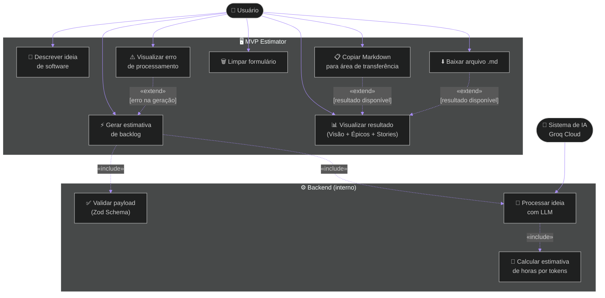

# Diagrama de Caso de Uso — MVP Estimator

> Representa os atores do sistema e as funcionalidades que cada um pode acionar, conforme o escopo definido no PRD.

---

## Atores

| Ator | Descrição |
|---|---|
| **Usuário** | Empreendedor, Product Owner ou Freelancer que acessa a interface web |
| **Sistema de IA (Groq)** | Serviço externo que processa a ideia e retorna o backlog estruturado |

---

## Diagrama

---

## Descrição dos Casos de Uso

### UC1 — Descrever ideia de software
- **Ator:** Usuário
- **Pré-condição:** Página carregada
- **Fluxo:** Usuário digita entre 10 e 2000 caracteres no campo de texto
- **Pós-condição:** Botão "Gerar estimativa" habilitado

### UC2 — Gerar estimativa de backlog
- **Ator:** Usuário
- **Pré-condição:** Descrição com mínimo de 10 caracteres
- **Fluxo principal:** Usuário clica em "Gerar estimativa" → sistema valida payload → envia para IA → exibe resultado
- **Fluxo alternativo:** Timeout (>60s) → exibe mensagem de erro com orientação
- **Inclui:** UC8 (validação), UC9 (processamento IA), UC10 (cálculo de horas)

### UC3 — Visualizar resultado
- **Ator:** Usuário
- **Pré-condição:** UC2 concluído com sucesso
- **Fluxo:** Sistema exibe visão do produto, épicos, user stories, critérios de aceitação e estimativa de horas

### UC4 — Copiar Markdown
- **Ator:** Usuário
- **Pré-condição:** UC3 ativo (resultado visível)
- **Fluxo:** Usuário clica "Copiar Markdown" → conteúdo vai para área de transferência → feedback visual "Copiado!"
- **Fluxo alternativo:** Permissão negada → fallback com `execCommand` → se falhar, exibe "Falha ao copiar"

### UC5 — Baixar arquivo .md
- **Ator:** Usuário
- **Pré-condição:** UC3 ativo
- **Fluxo:** Usuário clica "Baixar .md" → download do arquivo `mvp-estimator-YYYY-MM-DD.md`

### UC6 — Limpar formulário
- **Ator:** Usuário
- **Pré-condição:** Nenhuma
- **Fluxo:** Usuário clica "Limpar" → campo de texto, resultado e erros são resetados

### UC7 — Visualizar erro de processamento
- **Ator:** Usuário
- **Pré-condição:** UC2 falhou
- **Fluxo:** Sistema exibe callout vermelho com código do erro, mensagem e detalhes técnicos (quando disponíveis)

### UC8 — Validar payload (interno)
- **Ator:** Sistema (backend)
- **Fluxo:** Middleware Zod valida `ideaDescription` (string, 10–2000 chars) → rejeita com HTTP 400 se inválido

### UC9 — Processar ideia com LLM (interno)
- **Ator:** Sistema de IA (Groq)
- **Fluxo:** Backend envia prompt estruturado → Groq retorna JSON com visão, épicos e stories → sistema valida schema

### UC10 — Calcular estimativa de horas (interno)
- **Ator:** Sistema (backend)
- **Fluxo:** Soma `complexityTokens` de todas as stories → aplica fórmula `min = tokens/55`, `max = tokens/32`

---

*Versão: 1.1.0*
*Baseado no código real em `src/` e `frontend/src/`*
